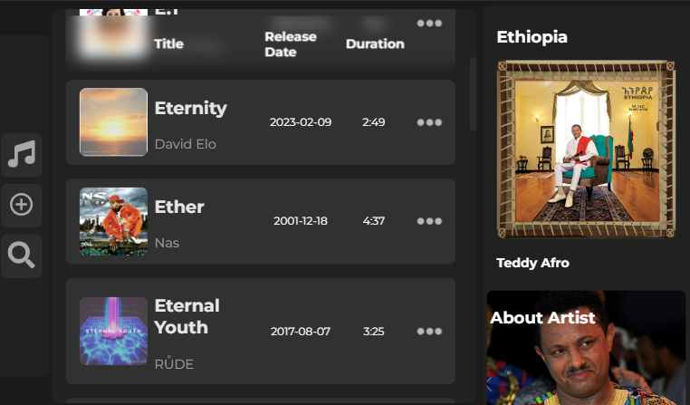

# Listnify - React Music Playlist Manager

Listnify is a sleek and user-friendly React application designed to help music enthusiasts manage their playlists effortlessly. With a beautiful UI powered by Emotion CSS, Listnify allows users to view, edit, add new songs, and delete songs from their playlists seamlessly.

## Features

- **View Songs:** Browse through your list of available songs with ease.
- **Edit Songs:** Modify song details such as title, artist, and album effortlessly.
- **View Details:** Dive into the specifics of each song with the detailed view option.
- **Add New Songs:** Expand your playlist by adding new songs effortlessly.
- **Delete Songs:** Remove unwanted songs from your playlist effortlessly.

## Installation

1. Clone the repository:

   ```bash
   git clone https://github.com/your-username/listnify.git
   ```

2. Install dependencies:

   ```bash
   cd listnify
   npm install
   ```

3. Start the development server:

   ```bash
   npm start
   ```

4. Open your browser and navigate to [http://localhost:3000](http://localhost:3000).

## Screenshots

### Dashboard


### Detailed View


### Edit Song


## Technologies Used

- React
- Emotion CSS
- Other dependencies (list them here)

## Contributing

Contributions are welcome! Please follow the [contribution guidelines](CONTRIBUTING.md).

## License

This project is licensed under the [MIT License](LICENSE).

## Acknowledgments

- Special thanks to [Name] for inspiration and guidance.
- Shoutout to the React and Emotion CSS communities.

Happy listening with Listnify! 🎵